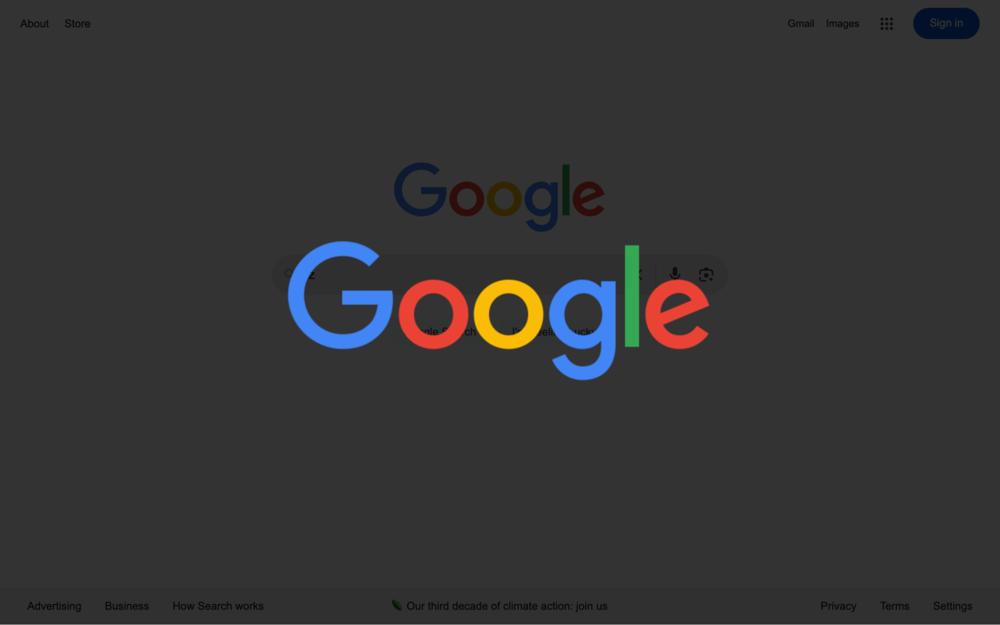

<h1 align="center">

&nbsp;&nbsp;&nbsp;&nbsp;
Image Magnifier
</h1>

Image Magnifier is a web browser extension that instantly enlarges images on any website using the 'Z' key + mouse click shortcut. Perfect for examining details in photos, diagrams, and artwork without leaving the page.

**Features:**
- Universal compatibility with all websites and image types
- No impact on page loading or performance
- Clean, minimalist interface
- Works with both static and dynamic content

## Usage
1. Hold the 'z' key
2. Click any image on the webpage
3. Close anywhere to close the image

## Screenshots

## For Developers
Looking to contribute or understand the codebase? Check out the [Technical Documentation](./docs/technical.md).

### Quick Start
1. Clone the repository
2. Load in Chrome or Firefox as unpacked extension opening the `scrc/manifest.json` file

## Licence
This project is licensed under the GNU General Public License v3.0 - see the [LICENSE](./LICENCE) file for details.